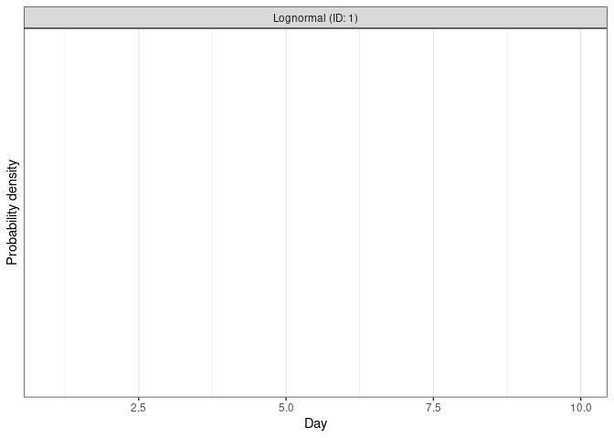

_This tutorial is partly based on this [nowcasting example](https://github.com/epiforecasts/nowcasting.example) from Sam Abbott and Sebastian Funk._

## Summary

- In this tutorial we make use of [EpiNow2](https://epiforecasts.io/EpiNow2/), a toolset for real-time analysis of infectious disease dynamics, for estimating reporting delays and using them to conduct a nowcast. 
- We first explore the HSS hospitalisation data and estimate the reporting delay distribution using `EpiNow2`.
- We then draw from the literature to define a plausible incubation period and reporting delay
- We then show how the these estimates may be used in `EpiNow2` to perform nowcasts, forecasts and estimation of reproduction numbers and growth rates. 
- Finally, we summarise strenghts and weaknesses of this approach and highlight other options and areas for future work.

For more `EpiNow2`  see the [the package documentation](https://epiforecasts.io/EpiNow2/). An [alternative approach](https://package.epinowcast.org) to the problems discussed in this tutorial is contained in `epinowcast`, this package is still under active development but aims to address the limitations `EpiNow2` with a view to eventually replacing it.

## Load required libraries

We first load the packages required for this tutorial. These can be installed using 

```r
renv::restore()
```

Ideally we recommend doing this sometime before you want to work through the rest of the tutorial as it may take some time.

```r
# Note this is the development version.
# Docs here: https://epiforecasts.io/EpiNow2/dev/
library("EpiNow2")
library("dplyr") # for manipulating data
library("ggplot2") # for plotting data
library("tidyr") # for manipulating data
library("purrr") # for manipulating data
library("covidcast") # for downlooading HHC hospitalisation data
library(here) # for file paths
```

## Load the data

Use the [covicast](https://cmu-delphi.github.io/covidcast/covidcastR/) package to read in data on confirmed covid-19 hospital admissions. The primary source for these data is the HHS state-level COVID-19 hospitalization time series, which can be found on [HealthData.gov](https://healthdata.gov/Hospital/COVID-19-Reported-Patient-Impact-and-Hospital-Capa/g62h-syeh). The [covidcast](https://cmu-delphi.github.io/covidcast/covidcastR/) package provides a convenient way to read in a subset of the full data set.
Here, we focus on the data from Ohio during the Omicron wave in winter 2021-2022. We could download the most recent version of this data directly using,


```r
oh_covid_hospitalizations <- covidcast_signal(
      data_source = "hhs",
      signal = "confirmed_admissions_covid_1d",
      start_day = "2021-12-01",
      end_day = "2022-02-01",
      geo_type = "state",
      geo_value = "oh"
    ) |>
      as_tibble() |>
      filter(issue == max(issue)) |>
      select(geo_value, time_value, value) |>
      rename(state = geo_value, date = time_value, confirm = value)
```

Rather than just downloading the data as it is available now we can also download versions of the data that would have been available at the time. This is equivalent to having a linelist with columns for the date of hospitalisiation and the date of report (*To download this much data you may need to register for a [`covidcast` API key](https://cmu-delphi.github.io/covidcast/covidcastR/reference/covidcast_signal.html)*).


```r
dates <- seq(as.Date("2021-12-03"), as.Date("2022-03-01"), by = "day")
# Read in the data for each date
oh_covid_hospitalizations_by_vintage <- dates |>
  purrr::map_df(\(x) (
    covidcast_signal(
      data_source = "hhs",
      signal = "confirmed_admissions_covid_1d",
      start_day = "2021-12-01",
      end_day = "2022-02-01",
      as_of = x,
      geo_type = "state",
      geo_value = "oh"
    ) |>
      mutate(report_date = x) |> # Add the date of report
      select(report_date, geo_value, time_value, value) |>
      rename(state = geo_value, date = time_value, confirm = value) |>
      arrange(date, report_date)
  )) |>
  as_tibble()
```

Rather than repeatedly querying the `covidcast` API we instead use the data we have already downloaded.


```r
oh_covid_hospitalizations <- readRDS(
  here("data", "oh_covid_hospitalizations.rds")
) |>
  as_tibble()

glimpse(oh_covid_hospitalizations)
```

```
## Rows: 63
## Columns: 3
## $ state   <chr> "oh", "oh", "oh", "oh", "oh", "oh", "oh", "oh", "oh", "oh", "o…
## $ date    <date> 2021-12-01, 2021-12-02, 2021-12-03, 2021-12-04, 2021-12-05, 2…
## $ confirm <dbl> 576, 620, 571, 532, 562, 594, 680, 687, 667, 634, 615, 566, 60…
```

```r
oh_covid_hospitalizations_by_vintage <- readRDS(
  here("data", "oh_covid_hospitalizations_by_vintage.rds")
) |>
  as_tibble()

glimpse(oh_covid_hospitalizations_by_vintage)
```

```
## Rows: 3,653
## Columns: 4
## $ report_date <date> 2021-12-03, 2021-12-04, 2021-12-04, 2021-12-05, 2021-12-0…
## $ state       <chr> "oh", "oh", "oh", "oh", "oh", "oh", "oh", "oh", "oh", "oh"…
## $ date        <date> 2021-12-01, 2021-12-01, 2021-12-02, 2021-12-01, 2021-12-0…
## $ confirm     <dbl> 574, 556, 556, 576, 620, 620, 574, 618, 578, 574, 577, 621…
```

# Data exploration

## Visualise  hospitalisations

We start by visualising the currently reported hospitalisations for this time period.


```r
oh_covid_hospitalizations |>
  ggplot() +
  aes(x = date, y = confirm) +
  geom_col(alpha = 0.6) +
  theme_bw() +
  labs(
    x = "Date of hospitalisation",
    y = "Hospitalisations",
    title = "Hospitalisations in Ohio for the winter 2021-2022 wave"
  )
```

<!-- -->

## Visualise hosptialisations by date of report

We now need to overlay what was actually observed at the time. We can do this by using the `oh_covid_hospitalizations_by_vintage` data frame to find the number of hospitalisations that were reported on each date.


```r
oh_covid_hospitalizations |>
  ggplot() +
  aes(x = date, y = confirm) +
  geom_point(alpha = 0.6) +
  geom_line(
    data = oh_covid_hospitalizations_by_vintage,
    aes(x = date, y = confirm, col = report_date, group = report_date),
    alpha = 0.8
  ) +
  scale_y_log10() +
  theme_bw() +
  labs(
    x = "Date of hospitalisation",
    y = "Hospitalisations",
    title = "Hospitalisations in Ohio for the winter 2021-2022 wave"
  ) +
  guides(col = guide_colorbar(title = "Date of report", barwidth = 15)) +
  theme(legend.position = "bottom")
```

<!-- -->

You should be able to see here that the data as observed in real-time is right truncated due to delays in reporting (i.e., it is an undercount of what will eventually be reported). If left uncorrected this can lead to an underestimation of the effective reproduction number, inaccurate forecasts, and potentially mislead policy makers using these metrics.

## Visualise the reporting delay

After way at looking at this is to plot the distribution of reporting delays. We can do this by calculating the delay between the date of hospitalisation and the date of report for each hospitalisation.


```r
oh_covid_hospitalizations_reporting_cdf <-
  oh_covid_hospitalizations_by_vintage |>
  filter(date >= as.Date("2021-12-14")) |>
  group_by(date) |>
  group_modify(
    ~ mutate(.x,
      diff = confirm - lag(confirm, default = 0),
      final_reported = .x |>
        filter(report_date == max(report_date)) |>
        pull(confirm)
    )
  ) |>
  ungroup() |>
  mutate(
    delay = as.numeric(report_date - date),
    cdf = confirm / final_reported
  )

glimpse(oh_covid_hospitalizations_reporting_cdf)
```

```
## Rows: 2,574
## Columns: 8
## $ date           <date> 2021-12-14, 2021-12-14, 2021-12-14, 2021-12-14, 2021-1…
## $ report_date    <date> 2021-12-16, 2021-12-17, 2021-12-18, 2021-12-19, 2021-1…
## $ state          <chr> "oh", "oh", "oh", "oh", "oh", "oh", "oh", "oh", "oh", "…
## $ confirm        <dbl> 567, 589, 588, 608, 608, 608, 608, 608, 608, 608, 608, …
## $ diff           <dbl> 567, 22, -1, 20, 0, 0, 0, 0, 0, 0, 0, 0, 0, 0, 0, 0, 0,…
## $ final_reported <dbl> 608, 608, 608, 608, 608, 608, 608, 608, 608, 608, 608, …
## $ delay          <dbl> 2, 3, 4, 5, 6, 7, 8, 9, 10, 11, 12, 13, 14, 15, 16, 17,…
## $ cdf            <dbl> 0.9325658, 0.9687500, 0.9671053, 1.0000000, 1.0000000, …
```

```r
oh_covid_hospitalizations_reporting_cdf |>
  filter(delay <= 14) |>
  ggplot() +
  aes(x = delay, y = cdf, group = date) +
  geom_step(alpha = 0.6) +
  theme_bw() +
  labs(
    x = "Reporting delay (days)",
    y = "Hospitalisations reported relative to the final count",
    title = "Reporting delay in Ohio for the winter 2021-2022 wave"
  )
```

<!-- -->

## Estimating the reporting delay

We use `EpiNow2` to estimate the distribution of reporting delays. This will then allow us to correct for right truncation in the data when we estimate the reproduction number. Unfortunately, the current model cannot account for over reporting and so we will first have to remove this from the data.


```r
options(mc.cores = 4)
truncation_est <- oh_covid_hospitalizations_reporting_cdf |>
  filter(date >= as.Date("2021-12-14")) |>
  filter(report_date >= as.Date("2022-01-01")) |>
  filter(report_date <= as.Date("2022-01-14")) |>
  group_by(date) |>
  mutate(confirm = max(confirm, dplyr::lag(confirm, default = 0))) |>
  ungroup() |>
  #over the new year reporting was delayed. This leads to problems for the model
  filter(report_date != as.Date("2022-01-05")) |>
  select(report_date, date, confirm) |>
  group_split(report_date) |>
  map(~select(., -report_date)) |>
  estimate_truncation(
    trunc_max = 10,
    chains = 4, iter = 2000,
    control = list(adapt_delta = 0.99, max_treedepth = 15),
    verbose = FALSE
  )

## Make the output a dist_spec object
truncation_dist <- do.call(dist_spec, truncation_est$dist)

truncation_dist
```

```
## 
##   Uncertain lognormal distribution with (untruncated) logmean -1.2 (SD 0.63) and logSD 0.27 (SD 0.22)
```

We can now visualise the estimated reporting delay.


```r
plot(truncation_dist)
```

<!-- -->

## Generation time estimate

The generation time is the time between infection of an individual and infection of their infector. In order to estimate the effective reproduction number with the renewal equation we need an estimae of  the generation time so that we can relate the number of infections on day $t$ to the number of infections on day $t - \tau$ where $\tau$ is the index of the generation time distribution. Mathematically this is

$$ I_t = R_t sum_{tau = 1}^T I_{t - \tau} G(\tau), $$

where $T$ is the maximum lenght of the generation time. Rather than estimating this here instead we use an estimate from the literature.


```r
generation_time <- get_generation_time(
  disease = "SARS-CoV-2", source = "ganyani",
  max = 10, fixed = TRUE
)
generation_time
```

```
## 
##   Fixed distribution with PMF [0.18 0.2 0.17 0.13 0.1 0.074 0.054 0.039 0.028 0.02]
```


```r
plot(generation_time)
```

<!-- -->

## Delays from infection to hospitalisation

Convolve the incubation period distribution with the distribution of delays from symptom onset to hospital admission to find the distribution of total delays. 

### Incubation period


```r
## Incubation period
incubation_period <- get_incubation_period(
  disease = "SARS-CoV-2", source = "lauer", fixed = TRUE,
  max = 15
)
incubation_period
```

```
## 
##   Fixed distribution with PMF [5.3e-05 0.013 0.093 0.18 0.2 0.17 0.12 0.083 0.053 0.033 0.02 0.012 0.0074 0.0046 0.0028]
```


```r
plot(incubation_period)
```

<!-- -->

### Delay from symptom onset to hospitalisation


```r
## Delay from symptom onset to report
reporting_delay <- dist_spec(
  mean = convert_to_logmean(3, 1),
  sd = convert_to_logsd(3, 1),
  max = 10
)
reporting_delay
```

```
## 
##   Fixed distribution with PMF [0.00064 0.14 0.43 0.29 0.11 0.03 0.008 0.0021 0.00053 0.00014]
```


```r
plot(reporting_delay)
```

<!-- -->

### Convolving the delay from infection to hospitalisation


```r
inf_to_hospitalisation <- incubation_period + reporting_delay
```


```r
plot(inf_to_hospitalisation)
```

<!-- -->

## Putting it all together into a nowcast

First we construct the data set of of hospitalisations using data as available on the 14th of January 2022.


```r
oh_hosp_14th <- oh_covid_hospitalizations_by_vintage |>
  filter(report_date == as.Date("2022-01-14")) |>
  select(date, confirm)

glimpse(oh_hosp_14th)
```

```
## Rows: 43
## Columns: 2
## $ date    <date> 2021-12-01, 2021-12-02, 2021-12-03, 2021-12-04, 2021-12-05, 2…
## $ confirm <dbl> 576, 620, 571, 532, 562, 594, 680, 687, 667, 634, 615, 566, 60…
```

In order to evaluate our model we will use the most recently reported data up to the 21st of January 2022 (as we are forecasting for a week).


```r
oh_hosp_21th_retro <- oh_covid_hospitalizations |>
  filter(date <= as.Date("2022-01-21")) |>
  select(date, confirm)
```

We then use the `estimate_infections` function contained in `EpiNow2` on this data set to obtain a nowcast, forecast and reproduction number estimate.


```r
options(mc.cores = 4)

rt_estimates <- estimate_infections(
  reported_cases = oh_hosp_14th,
  generation_time = generation_time_opts(generation_time),
  delays = delay_opts(inf_to_hospitalisation),
  rt = rt_opts(
    prior = list(mean = 1, sd = 0.1), rw = 7
  ),
  # Here we have turned off the default Gaussian process prior in facvour of 
  # the random walk specified in rt_opts
  gp = NULL,
  stan = stan_opts(
    control = list(adapt_delta = 0.99),
    samples = 2000, warmup = 500
  ),
  obs = obs_opts(
    family = "negbin", week_effect = TRUE
  ),
  horizon = 14
)
```


## Visualising the results


### Effective reproduction number estimates


```r
plot(rt_estimates, type = "R")
```

<!-- -->

### Predicted hospitalisations


```r
rt_estimates |>
  pluck("summarised") |>
  filter(variable %in% "reported_cases") |>
  plot_estimates(
    reported = oh_hosp_21th_retro
  )
```

<!-- -->

## Summary

### Limitations

### 
## References
