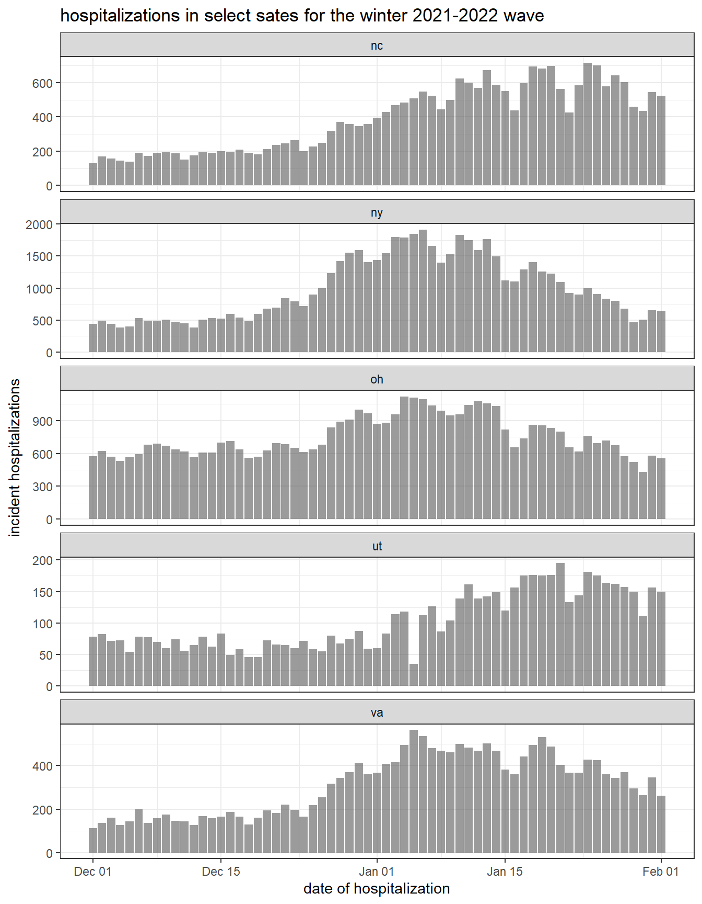
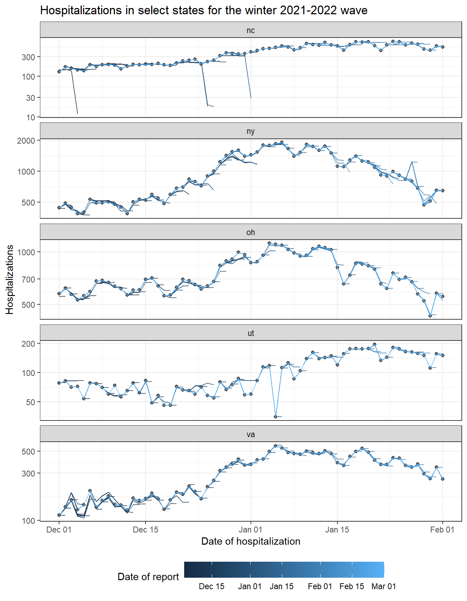
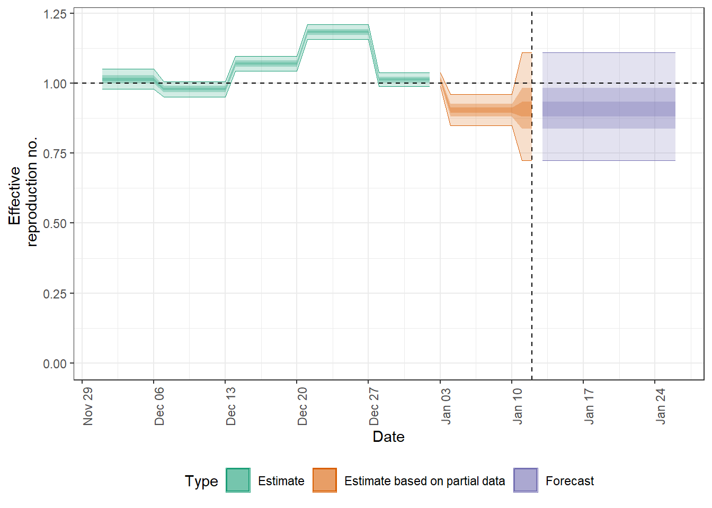

_This tutorial is partly based on this [nowcasting example](https://github.com/epiforecasts/nowcasting.example) from Sam Abbott and Sebastian Funk._

## Summary

- In this tutorial we make use of [EpiNow2](https://epiforecasts.io/EpiNow2/), a toolset for real-time analysis of infectious disease dynamics, for estimating reporting delays and using them to conduct a nowcast. 
- We first explore the HSS hospitalisation data and estimate the reporting delay distribution using `EpiNow2`.
- We then draw from the literature to define a plausible incubation period and reporting delay
- We then show how the these estimates may be used in `EpiNow2` to perform nowcasts, forecasts and estimation of reproduction numbers and growth rates. 
- Finally, we summarise strenghts and weaknesses of this approach and highlight other options and areas for future work.

For more `EpiNow2`  see the [the package documentation](https://epiforecasts.io/EpiNow2/). An [alternative approach](https://package.epinowcast.org) to the problems discussed in this tutorial is contained in `epinowcast`, this package is still under active development but aims to address the limitations `EpiNow2` with a view to eventually replacing it.

## Load required libraries

We first load the packages required for this tutorial. These can be installed using

```r
renv::restore()
```

> :warning: **`renv::restore()` will take some time to run and produce output**: It is a command that will automatically load or install the correct versions of all packages needed to run this analysis. Ideally we recommend doing this sometime before you want to work through the rest of the tutorial as it may take some time.


```r
# Note this is the development version.
# Docs here: https://epiforecasts.io/EpiNow2/dev/
library("EpiNow2")
library("dplyr") # for manipulating data
library("ggplot2") # for plotting data
library("tidyr") # for manipulating data
library("purrr") # for manipulating data
library("covidcast") # for downlooading HHC hospitalisation data
library(here) # for file paths
```

## Load the data

Use the [covicast](https://cmu-delphi.github.io/covidcast/covidcastR/) package to read in data on confirmed covid-19 hospital admissions. The primary source for these data is the HHS state-level COVID-19 hospitalization time series, which can be found on [HealthData.gov](https://healthdata.gov/Hospital/COVID-19-Reported-Patient-Impact-and-Hospital-Capa/g62h-syeh). The [covidcast](https://cmu-delphi.github.io/covidcast/covidcastR/) package provides a convenient way to read in a subset of the full data set.
Here, we focus on the data from New York, Utah, Ohio, Virginia, and North Carolina during the Omicron wave in winter 2021-2022. We could download the most recent version of this data directly using,


```r
covid_hospitalizations <- covidcast_signal(
      data_source = "hhs",
      signal = "confirmed_admissions_covid_1d",
      start_day = "2021-12-01",
      end_day = "2022-02-01",
      geo_type = "state",
      geo_value = c("ny", "ut", "oh", "va", "nc")
    ) |>
      as_tibble() |>
      filter(issue == max(issue)) |>
      select(geo_value, time_value, value) |>
      rename(state = geo_value, date = time_value, confirm = value)
```

Rather than just downloading the data as it is available now we can also download versions of the data that would have been available at the time. This is equivalent to having a linelist with columns for the date of hospitalisiation and the date of report (*To download this much data you may need to register for a [`covidcast` API key](https://cmu-delphi.github.io/covidcast/covidcastR/reference/covidcast_signal.html). This then needs to be loaded into R using `options(covidcast.auth = "<your-api-key")`*).


```r
dates <- seq(as.Date("2021-12-03"), as.Date("2022-03-01"), by = "day")
# Read in the data for each date
covid_hospitalizations_by_vintage <- dates |>
  purrr::map_df(\(x) (
    covidcast_signal(
      data_source = "hhs",
      signal = "confirmed_admissions_covid_1d",
      start_day = "2021-12-01",
      end_day = "2022-02-01",
      as_of = x,
      geo_type = "state",
      geo_value = c("ny", "ut", "oh", "va", "nc")
    ) |>
      mutate(report_date = x) |> # Add the date of report
      select(report_date, geo_value, time_value, value) |>
      rename(state = geo_value, date = time_value, confirm = value) |>
      arrange(date, report_date)
  )) |>
  as_tibble()
```

Rather than repeatedly querying the `covidcast` API we instead use the data we have already downloaded.


```r
covid_hospitalizations <- readRDS(
  here("data", "covid_hospitalizations.rds")
) |>
  as_tibble()

glimpse(covid_hospitalizations)
```

```
## Rows: 315
## Columns: 3
## $ state   <chr> "nc", "ny", "oh", "ut", "va", "nc", "ny", "oh", "ut", "va", "n…
## $ date    <date> 2021-12-01, 2021-12-01, 2021-12-01, 2021-12-01, 2021-12-01, 2…
## $ confirm <dbl> 128, 443, 576, 78, 113, 169, 490, 620, 82, 137, 157, 444, 571,…
```

```r
covid_hospitalizations_by_vintage <- readRDS(
  here("data", "covid_hospitalizations_by_vintage.rds")
) |>
  as_tibble()

glimpse(covid_hospitalizations_by_vintage)
```

```
## Rows: 18,265
## Columns: 4
## $ report_date <date> 2021-12-03, 2021-12-03, 2021-12-03, 2021-12-03, 2021-12-0…
## $ state       <chr> "nc", "ny", "oh", "ut", "va", "nc", "ny", "oh", "ut", "va"…
## $ date        <date> 2021-12-01, 2021-12-01, 2021-12-01, 2021-12-01, 2021-12-0…
## $ confirm     <dbl> 140, 456, 574, 80, 107, 141, 439, 556, 79, 114, 141, 435, …
```

# Data exploration

## Visualise  hospitalisations

We start by visualising the currently reported hospitalisations for this time period.


```r
covid_hospitalizations |>
  ggplot() +
  aes(x = date, y = confirm) +
  geom_col(alpha = 0.6) +
  theme_bw() +
  labs(
    x = "Date of hospitalisation",
    y = "Hospitalisations",
    title = "Hospitalisations in select sates for the winter 2021-2022 wave"
  ) +
  facet_wrap(vars(state), ncol = 1, scales = "free_y")
```

<!-- -->

As expected we see a large increase in hospitalisations in all states during the winter 2021-2022 wave. However, we can also see that there is a large amount of variation in the number of hospitalisations reported on each date and state by state. 

## Visualise hosptialisations by date of report

Whilst it is interesting to look back retrospectively when analysing data it is important to remember that the data we have now is not the same as the data that was available at the time. This can occurr for a number of reasons, for example, there may be a delay between the date of hospitalisation and the date of report or there may be changes in how hospitalisations are measured which leads to a retrospective change in the number of hospitalisations.

To begin to unpick this we can look at the number of hospitalisations as it was reported. We should see that that the number of hospitalisations reported on each date increases over time as more data becomes available if the changes are caused only by delays. If reporting is more complex than this, for example, if hospitalisations can be recategorised to a different day then the number of hospitalisations reported for a given day may decrease as well as increase over time.


```r
covid_hospitalizations |>
  ggplot() +
  aes(x = date, y = confirm) +
  geom_point(alpha = 0.6) +
  geom_line(
    data = covid_hospitalizations_by_vintage,
    aes(x = date, y = confirm, col = report_date, group = report_date),
    alpha = 0.8
  ) +
  scale_y_log10() +
  theme_bw() +
  labs(
    x = "Date of hospitalisation",
    y = "Hospitalisations",
    title = "Hospitalisations in select states for the winter 2021-2022 wave"
  ) +
  guides(col = guide_colorbar(title = "Date of report", barwidth = 15)) +
  theme(legend.position = "bottom") +
  facet_wrap(vars(state), ncol = 1, scales = "free_y")
```

<!-- -->

You should be able to see here that the data as observed in real-time is right truncated due to delays in reporting during the exponential phase of the wave (i.e., it is an undercount of what will eventually be reported). If left uncorrected this can lead to an underestimation of the effective reproduction number, inaccurate forecasts, and potentially mislead policy makers using these metrics.

However, it appears that hospitalisations are also very commonly corrected down, this indicates a more complex reporting mechanism is at play. Unfortunately, currently currently there are few available methods that can address this kind of reporting structure and the development of new ones is likely dependent on the interaction between those collecting the data and those developing new methods.

## Visualise the reporting delay

Another way at looking at this is to plot the distribution of reporting delays. We can do this by calculating the delay between the date of hospitalisation and the date of report for each hospitalisation.


```r
covid_hospitalizations_reporting_cdf <-
  covid_hospitalizations_by_vintage |>
  filter(date >= as.Date("2021-12-01")) |>
  group_by(date, state) |>
  group_modify(
    ~ mutate(.x,
      diff = confirm - lag(confirm, default = 0),
      final_reported = .x |>
        filter(report_date == max(report_date)) |>
        pull(confirm)
    )
  ) |>
  ungroup() |>
  mutate(
    delay = as.numeric(report_date - date),
    cdf = confirm / final_reported
  )

glimpse(covid_hospitalizations_reporting_cdf)
```

```
## Rows: 18,265
## Columns: 8
## $ date           <date> 2021-12-01, 2021-12-01, 2021-12-01, 2021-12-01, 2021-1…
## $ state          <chr> "nc", "nc", "nc", "nc", "nc", "nc", "nc", "nc", "nc", "…
## $ report_date    <date> 2021-12-03, 2021-12-04, 2021-12-05, 2021-12-06, 2021-1…
## $ confirm        <dbl> 140, 141, 142, 142, 128, 128, 128, 128, 128, 128, 128, …
## $ diff           <dbl> 140, 1, 1, 0, -14, 0, 0, 0, 0, 0, 0, 0, 0, 0, 0, 0, 0, …
## $ final_reported <dbl> 128, 128, 128, 128, 128, 128, 128, 128, 128, 128, 128, …
## $ delay          <dbl> 2, 3, 4, 5, 6, 7, 8, 9, 10, 11, 12, 13, 14, 15, 16, 17,…
## $ cdf            <dbl> 1.093750, 1.101562, 1.109375, 1.109375, 1.000000, 1.000…
```

```r
covid_hospitalizations_reporting_cdf |>
  filter(delay <= 10) |>
  ggplot() +
  aes(x = delay, y = cdf, group = date) +
  geom_step(alpha = 0.4) +
  theme_bw() +
  labs(
    x = "Reporting delay (days)",
    y = "Hospitalisations reported relative to the final count",
    title = "Reporting delay in select states for the winter 2021-2022 wave"
  ) +
  facet_wrap(vars(state), ncol = 1, scales = "free_y")
```

<!-- -->

For the rest of this tutorial we focus on Ohio. You can repeat the analysis for other states by changing the `state` variable being `filter`ed for in the following code chunks.

## Estimating the reporting delay

We use `EpiNow2` to estimate the distribution of reporting delays for Ohio as this method can account for right truncation when estimating delays. This will then allow us to correct for right truncation in the data, if it is present, when we estimate the reproduction number. Unfortunately (as already noted), the current model cannot account for over reporting and so we will first have to remove this from the data.


```r
options(mc.cores = 4)

truncation_est <- covid_hospitalizations_reporting_cdf |>
  filter(state == "oh") |>
  filter(date >= as.Date("2021-12-14")) |>
  filter(report_date >= as.Date("2021-12-31")) |>
  filter(report_date <= as.Date("2022-01-14")) |>
  group_by(date) |>
  mutate(confirm = max(confirm, dplyr::lag(confirm, default = 0))) |>
  ungroup() |>
  #over the new year reporting was delayed. This leads to problems for the model
  filter(report_date != as.Date("2022-01-05")) |>
  select(report_date, date, confirm) |>
  group_split(report_date) |>
  map(~select(., -report_date)) |>
  estimate_truncation(
    trunc_max = 7,
    chains = 4, iter = 2000,
    control = list(adapt_delta = 0.99, max_treedepth = 15),
    verbose = FALSE
  )

## Make the output a dist_spec object
truncation_dist <- do.call(
  dist_spec, c(truncation_est$dist)
)

truncation_dist
```

```
## 
##   Uncertain lognormal distribution with (untruncated) logmean -1.2 (SD 0.63) and logSD 0.25 (SD 0.21)
```


```r
plot(truncation_dist)
```

<!-- -->

**There is very little truncation in this data for this time period.** This is good news as it means we can use the data as observed to estimate the reproduction number..

## Generation time estimate

The generation time is the time between infection of an individual and infection of their infector. In order to estimate the effective reproduction number with the renewal equation we need an estimae of  the generation time so that we can relate the number of infections on day $t$ to the number of infections on day $t - \tau$ where $\tau$ is the index of the generation time distribution. Mathematically this is

$$ I_t = R_t \sum_{tau = 1}^T I_{t - \tau} G(\tau), $$

where $T$ is the maximum lenght of the generation time. Rather than estimating this here instead we use an estimate from the literature. Specifically we use an estimate from Ganyani et al. (2020) which is based on several hundred cases of COVID-19 in China. For a real-world analysis we recommend thinking carefully about which generation time distribution to use. For example, the Ganyani et al. (2020) estimate is based on a sample of cases from China and so may not be representative of the generation time in other settings.


```r
generation_time <- get_generation_time(
  disease = "SARS-CoV-2", source = "ganyani",
  max = 10, fixed = TRUE
)
generation_time
```

```
## 
##   Fixed distribution with PMF [0.18 0.2 0.17 0.13 0.1 0.074 0.054 0.039 0.028 0.02]
```

We can now visualise this distribution.


```r
plot(generation_time)
```

<!-- -->

## Delays from infection to hospitalisation

The delay between infection and hospitalisation can be decomposed into two distributions: the incubation period and the delay from symptom onset to hospitalisation. We can estimate these distributions using `EpiNow2` but for this tutorial we will use estimates from the literature.

### Incubation period

The incubation period is the time between infection and symptom onset. Here we use an estimate from Lauer et al. (2020) which is based again based on a few hundred cases of COVID-19 in China. For a real-world analysis we recommend thinking carefully about which incubation period distribution to use just as we did for the generation time.


```r
incubation_period <- get_incubation_period(
  disease = "SARS-CoV-2", source = "lauer", fixed = TRUE,
  max = 15
)
incubation_period
```

```
## 
##   Fixed distribution with PMF [5.3e-05 0.013 0.093 0.18 0.2 0.17 0.12 0.083 0.053 0.033 0.02 0.012 0.0074 0.0046 0.0028]
```

We can now visualise this distribution.


```r
plot(incubation_period)
```

<!-- -->

### Delay from symptom onset to hospitalisation

The delay from symptom onset to hospitalisation is the time between symptom onset and hospital admission. This typically depends on the severity of sypmtoms, the robustness of the health system and the behaviour of the individual. Here we use a toy estimate motivated by our experience but ideally data would be available to estimate this quantity.


```r
## Delay from symptom onset to report
reporting_delay <- dist_spec(
  mean = convert_to_logmean(3, 1),
  sd = convert_to_logsd(3, 1),
  max = 10
)
reporting_delay
```

```
## 
##   Fixed distribution with PMF [0.00064 0.14 0.43 0.29 0.11 0.03 0.008 0.0021 0.00053 0.00014]
```

We can again visualise this distribution.


```r
plot(reporting_delay)
```

<!-- -->

### Convolving the delay from infection to hospitalisation

As the incubation period and reporting delay can be represented as probability mass functiosn (i.e., vectors of probabilities) we can convolve them to find the distribution of delays from infection to hospitalisation. This helps reduce the computational burden of the model as we do not need to model multiple delays. It is also useful as it allows us to understand the combined effect of the incubation period and reporting delay on the delay from infection to hospitalisation.


```r
inf_to_hospitalisation <- incubation_period + reporting_delay
```

We can now plot this convolved distribution.


```r
plot(inf_to_hospitalisation)
```

<!-- -->

## Putting it all together into a nowcast

Now we have all the components we need to construct a nowcast. First we construct the data set of hospitalisations we wish to nowcast using data as available on the 14th of January 2022.


```r
oh_hosp_14th <- covid_hospitalizations_by_vintage |>
  filter(state == "oh") |>
  filter(report_date == as.Date("2022-01-14")) |>
  select(date, confirm)

glimpse(oh_hosp_14th)
```

```
## Rows: 43
## Columns: 2
## $ date    <date> 2021-12-01, 2021-12-02, 2021-12-03, 2021-12-04, 2021-12-05, 2…
## $ confirm <dbl> 576, 620, 571, 532, 562, 594, 680, 687, 667, 634, 615, 566, 60…
```

In order to evaluate our model we will use the most recently reported data up to the 21st of January 2022 (as we are forecasting for a week).


```r
oh_hosp_21th_retro <- covid_hospitalizations |>
  filter(state == "oh") |>
  filter(date <= as.Date("2022-01-21")) |>
  select(date, confirm)
```

We then use the `estimate_infections()` function contained in `EpiNow2` on this data set to obtain a nowcast, forecast and reproduction number estimate. This model uses a renewal equation based method to estimate the reproduction number and then convolves this with the incubation period and reporting delay we defined earlier to obtain a nowcast. It generates a forecast extrapolating the reproduction number estimate into the future. This is just an example model as there are many other ways to estimate the reproduction number and many other ways to extrapolate it into the future. We recommend thinking carefully about which model to use for your analysis.


```r
options(mc.cores = 4)

rt_estimates <- estimate_infections(
  reported_cases = oh_hosp_14th,
  # Our generation time estimate is first preprocessed into a format the model
  # understands
  generation_time = generation_time_opts(generation_time),
  # Similarly our delay from infection to hospitalisation is also preprocessed.
  delays = delay_opts(inf_to_hospitalisation),
  rt = rt_opts(
    # Here we specify a prior for hte initial value of the reproduction number
    # We set this to be near 1 as we expect the epidemic to be growing slowly
    # at the start of the period of interest
    prior = list(mean = 1, sd = 0.1),
    # This indicates the perid of the random walk we wish to use (7 days).
    rw = 7
  ),
  # Here we have turned off the default Gaussian process prior in facvour of 
  # the random walk specified in rt_opts
  gp = NULL,
  # These options control the MCMC sampler used to estimate the posterior
  # This uses the No-U-Turn sampler with a target acceptance rate of 99%
  # and 2000 samples with 500 warmup iterations.
  stan = stan_opts(
    control = list(adapt_delta = 0.99),
    samples = 2000, warmup = 500
  ),
  # These options control the observation model. We use a Poisson observation
  # model with a day of the week effect
  obs = obs_opts(
    family = "poisson", week_effect = TRUE
  ),
  # This controls the forecast horizon. We forecast 14 days into the future.
  horizon = 14
)
```

 Note we haven't adjusted for truncation as there was little evidence of truncation in the weeks directly before this date (as noted above).

## Visualising the results

### Effective reproduction number estimates

Using the output of `estimate_infections()` we can visualise the effective reproduction number estimates using a call to `plot()` (this has a range of other plotting options which can be explored using `?EpiNow2:::plot.estimate_infections`).


```r
plot(rt_estimates, type = "R")
```

<!-- -->

### Predicted hospitalisations

Another useful plot is the predicted hospitalisations. This can be obtained using the `plot_estimates()` function. This function takes a data frame of estimates and a data frame of reported cases and plots the estimates alongside the reported cases. 

Whilst the forecast is useful it is important to note that it is based on the assumption that the reproduction number remains constant at the last estimated value (though other options are supported in the package). This is unlikely to always be true in practice and so the forecast should be communicated with this in mind. 


```r
rt_estimates |>
  pluck("summarised") |>
  filter(variable %in% "reported_cases") |>
  plot_estimates(
    reported = oh_hosp_21th_retro
  )
```

<!-- -->

We see that the forecast performs relatively well when compared to more recent data.

## Summary

- We have shown how to use `EpiNow2` to estimate the effective reproduction number and forecast hospitalisations.
- We have also explored how to use `EpiNow2` to estimate the delay from infection to hospitalisation.
- Finally, we have discussed some limitations of the approach and how to communicate these.

### Strengths

### Limitations

### Other resources

- [EpiNow2 website](https://epiforecasts.io/EpiNow2/)
- [epinowcast](https://package.epinowcast.org): This package has been designed as the successor to `EpiNow2` and is currently under development. It is designed to be more flexible and easier to use than `EpiNow2`.
- [epidemia](https://imperialcollegelondon.github.io/epidemia/index.html): This is another flexible package for estimating the effective reproduction number and forecasting. It is designed to be more flexible than `EpiNow2` and `epinowcast` but is potentially more difficult to use. It also generally has less functionality for dealing with delays than `EpiNow2` and `epinowcast`.
- [EpiEstim](https://cran.r-project.org/web/packages/EpiEstim/index.html): This is a more mature package for estimating the effective reproduction number. It exploits a mathematically relationship to fit the renewal equation very quickly but is not currently able to handle reporting delays or to produce forecasts which the use of supporting packages

## References
